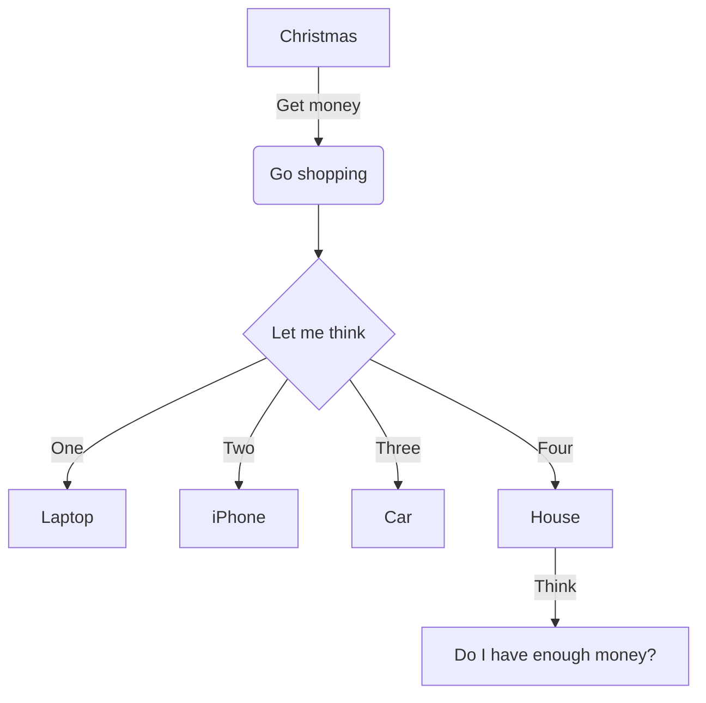

# Mermaid in Markdown

```mermaid
graph TD
    A[Christmas] -->|Get money| B(Go shopping)
    B --> C{Let me think}
    C -->|One| D[Laptop]
    C -->|Two| E[iPhone]
    C -->|Three| F[Car]
    C -->|Four | G[House]
    G -->|Think | H[Do I have enough money?]
```
