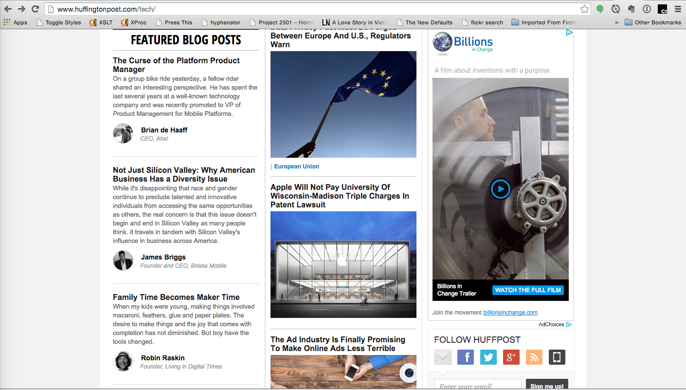
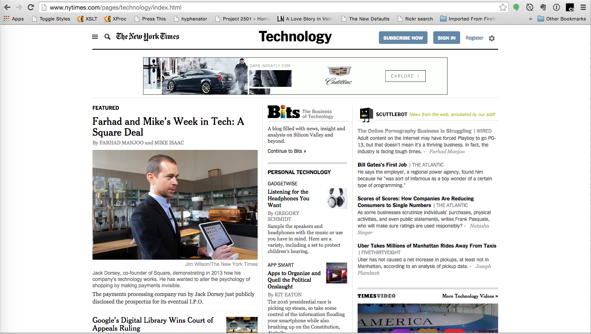

# Books in a digital world

I've been reading a lot of ebooks lately. I've also added a few more paper books to my collection (much to my parents' dismay) and have read a few articles online. One of those online articles was the latest was a post from Craig Mod to the [Roden Explorers Mailing List](http://craigmod.com/sputnik/invitation/) where he points to a new essay on [Future Reading](http://aeon.co/magazine/technology/why-have-digital-books-stopped-evolving/) and reading ecosystems.

In this essay I'll address the ecosystem question and my ideas about a writing continuum centered around an open web implementation and how we can leverage new and upcoming technologies to overcome the advantage of native and closed ecosystems.

> I'm not saying that printed books are not important or that ebooks are more important than printed books. Depending on the function printed is better than electronic and the physicality can enhance the reading experience.
> 
> Using HTML as the basis for our content also give us flexibility that is not possible with native apps, even when you use tools like Phone Gap / Apache Cordoba. 

## The big change

I got an iPad through work around 2010 and it was a love at first sight. It wasn't long after that I became aware of of books and how to build them.  I've been working on that ever since. 

Just like web development I grew disenchated with all the tricks that you have to implement to get all readers to actually display content in a similar way... even readers that, supposedly, support the same standard.
There were two events that made me wonder if I wasn't looking this problem from the wrong angle. 
* The New York Times published [Snowfall](http://www.nytimes.com/projects/2012/snow-fall/#/?part=tunnel-creek) and the Washington Post released  [Scaling Everest](http://www.washingtonpost.com/graphics/world/scaling-everest/). They both caught my attention not because of the stories they told but how they leveraged technology to do so
* From a technology standpoint there are technologies that make web applications look like native:  [Service Workers](https://github.com/slightlyoff/ServiceWorker/blob/master/explainer.md)  and the [Push](http://w3c.github.io/push-api/), [Notifications](https://notifications.spec.whatwg.org/)  and [Web Background Sync](https://slightlyoff.github.io/BackgroundSync/spec/)(unofficial proposal) APIs.

The articles give you an idea of what content can look like while the new APIs give you the means to make your web applications behave more like native by synchronizing content in the background and the notifying the user when there is new content for them.  

## Redefining publishing

> Publishing is the process of production and dissemination of literature, music, or information — the activity of making information available to the general public. In some cases, authors may be their own publishers, meaning originators and developers of content also provide media to deliver and display the content for the same. 
>  
> From [Wikipedia](https://www.wikiwand.com/en/Publishing)

Since blogging became popular  one of the questions I hear failry often is **are bloggers publishers?** which I would then expand to **are web sites or content management systems publishing**?

Blogs and their related ecosystems redefine the concept of publishing.  But it gets even more complicated like that when traditional publishing enterprises and, furthermore, there are **born-digital** publishers who have never known any other medium and more adept and flexible than traditional publishers entering the digital space for the first time or who have tried before but are entering the digital space again after previous failures.   

Most of these **born digital** or **digital first** publishers look at the customer first. Knowing who their audience is these companies can develop contextual frameworks that target their audience and make the publisher's properties unique and attractive to them... this is easier for newcomers who are fluent on digital technlogies than it is for incumbent media companies who are set in their ways and can't always attract new talent to compensate. 

Online organization is also important. If you look at sites like [The New York Times](http://www.nytimes.com/), it mirrors the structure of the printed newspaper the content was originally created for before it was enhanced with online-only additions. Snowfall and Scaling Everest have started to change the mold but it's too soon to tell if their model will be widely implemented.  

To contrast look at sites like [The Huffington Post](http://www.huffingtonpost.com/) where the content is less page/article based and more vertical context based.  In sites like the post that function as agreggators and blogging platforms the content is divided differently and is not created from a single source. 

In the home page for the Post's technology session (captured October 17th) we can see featured posts by:

- The CEO of [Aha!](http://www.aha.io/)
- The founder and CEO of [Briabe Mobile](http://www.briabemobile.com/)
- The founder of [Living In Digital Times](http://livingindigitaltimes.com/)

We can also compare the Post's technology page with the New York Time's (captured Octobe 17th) , shown below in terms of organization and content covered. 

While I use the New York Times as an example of **old media** they have done a great job of adapting their content to digital formats. 

I know I haven't answered the questions I started this section with.  I don't have an answer as, in my opinion, the answer will change bassed on individual projects. Is CNN (using [Wordpress VIP service](https://vip.wordpress.com/)) a publishing company? is my publishing blog (using a [locally hosted instance of Wordpres](https://wordpress.org/))?

# Closed versus open reading systems

The debate has always been "open or closed." Do we open out system to the public and let them collaborate in its evolution or do we keep the system behind protective barriers so we can make a profit out of it at the expense of the community that has helped us so far?

When I first saw the Kindle I thought that it was good in concept and poor in exection and, from a developer standpoint, it has not improved since my first encounter with it.  If nothing else it has  become more convoluted, hard to follow and hard to implement reliably for the multiple versions of the platform... Internet Explorer in the mid 90s anyone?

Apple coopted the epub standard with propietary extensions that will only work with their iBooks reader for both Desktop and iOS without consideration to other parts of the user's daily life, either iBooks or nothing at all. Most of the cool things you can do in iBooks can also be done in an other readers using epub and other IDPF standards... yet you still have to do twice the work to acommodate both iBooks and other readers.

Amazon has gone even further than Apple. They different Kindle formats (Mobi, KF7, KF8,) are not compatible with each other, much less with other vendors' reader. Your design for Kindle is highly dependent on what devices you're designing for. 

eBook Architects has a good page about different [ebook formats](http://ebookarchitects.com/learn-about-ebooks/formats/)as part of their Learn About ebooks site.

But what if we could make an open web system work more like a native application? Would this be enough to tilt the balance back towards the open web? 

It would certainly make life easier for developers as we'd be able to design once and deploy anywhere, we would gain the advantages of offline access, push notifications and background synching, and that's just a starting point. 

The web browser becomes our the application's runtime. Since we can't be sure of the browser our users will view our content with we need to make sure that we code deffensively... even more so than in our regular applications.  We have three options:
1. Only work with modern browsers (defined here as those who support the technologies we want to use natively) and leave older browsers out of the equation
2. Polyfill the technologies to the extent it's possible with the understanding that browsers using polyfills will be much slower and unreliable than thosse using the technologies natively
3. Working with older technologies with wide browser support

Option 1 may or may not be acceptable depending on your target audience.  Option 2 is a fair compromise as browsers implement technologies and users upgrade to newer browser versions, but we aware that this may be an issue in a centrally managed IT environment. Option 3 defeats the purpose of the new technologies as the widely supported browsers will not support the new technologies without polyfills. 

## DRM rears its ugly head

One of the first obstacles to overcome is the publishers desire and perceived need for digital right management or some other sort of restriction on ownership, multi device use and sharing of our owned content with others.
I understand how publishers and authors have to provide DRM (Digital Rights Management) protection for their content but it just doesn't work. 
* It doesn't protect the content. Google [stripping Kindle DRM](https://www.google.com/?gws_rd=ssl#q=stripping+Kindle+DRM)for a look at how many sites cover the subject and look at this [Ars Technica article](http://arstechnica.com/gadgets/2012/10/drm-be-damned-how-to-protect-your-amazon-e-books-from-being-deleted/) for concrete solutions
* It takes away actual ownership of the books . Unlike printed books the vendor can dictate what you can and cannot do with your purchases; for example:
	* In 2009 [Amazon unilaterally erased](http://www.nytimes.com/2009/07/18/technology/companies/18amazon.html?_r=0) an unauthorized edition of  1984 and Animal Farm, I would imageine Apple and other vendors can do the same thing. They claimed they removed the books because they were of an unauthorized edition but that could have definitely been handled better
	* In 2012 Amazon removed access to a user's account from Norway because the device had been purchased in the UK (may not be the actual reason but Amazon never gave an answer as to why the account was blocked.)  [The story](https://translate.google.com/translate?sl=auto&tl=en&js=y&prev=_t&hl=en&ie=UTF-8&u=http%3A%2F%2Fwww.nrk.no%2Fkultur-og-underholdning%2F1.8368487&edit-text=&act=url) and [the followup](https://translate.google.com/translate?sl=auto&tl=en&js=y&prev=_t&hl=en&ie=UTF-8&u=http%3A%2F%2Fwww.nrk.no%2Fkultur-og-underholdning%2F1.8368487&edit-text=&act=url) (translated from Norwegian by Google Translate)
* There is no evidence that it works as a deterrent but there is anecdotal evidence that companies that do not use DRM ([O'Reilly](http://shop.oreilly.com/category/ebooks.do), [Pragmatic Programmers](https://pragprog.com/frequently-asked-questions/ebooks), [Tor Books](http://www.tor.com/2014/05/28/tom-doherty-tor-books-book-expo-of-america-2014/) and possibly others)  have not seen a decrease in sales
* It demonstrate an alarming lack of trust in the users. It sends the message that protecting content is more important than anything the users can do with their books
* It muddles the definition of ownership. When we buy an ebook is it an actual sale, like with printed books, or is it a license?

# New Technologies
My idea to make a push for web applications is to use some of the new CSS specifications and JavaScript APIs. I will explore some of these technologies that I see as essential.

## Service Workers: The web goes offline
Service worker is a type of [web worker](http://www.html5rocks.com/en/tutorials/workers/basics/) that acts as a reverse proxy for connections that affect you site or app. Specifically:

> ServiceWorker is a background worker, it gives us a JavaScript context to add features such as push messaging, background sync, geofencing and network control.
> 
> In terms of network control, it acts like a proxy server sitting on the client, you get to decide what to do on a request-by-request basis. You can use this to make stuff work faster, offline, or build new features.
> 
> From [Using ServiceWorker Today](https://jakearchibald.com/2014/using-serviceworker-today/ "Using ServiceWorker Today")

The most important aspect of Service Workers is that they work regardless of network status; network connectivity  becomes an enhancement. A ServiceWorker based solution will always be faster... sure, after first load we're serving cached content but the user doesn't know that and, to be honest, they probably wouldn't care.

The video below shows Jake Archibald's  [Trained To Thrill](https://jakearchibald.github.io/trained-to-thrill/) on mobile,  the left side without service worker and the right side the same application getting the content from the service worker cache. 

  <iframe width="560" height="315" src="https://www.youtube.com/embed/px-J9Ghvcx4?rel=0" frameborder="0" allowfullscreen="allowfullscreen"></iframe>

You can see how much faster the cache application loads content from the cache and then, if needed, goes to the network to fetch new content. It's transparent to the user and we get a usable application much faster than if we just rely on the network
 
[Lyza Danger Gardner](http://www.lyza.com/) poses a [series of questions and challenges](http://alistapart.com/column/how-do-we-get-it-done-now) to developers .  She reminds us that ServiceWorkers are a revolutionary development from an older technology: [AppCache](http://www.w3.org/TR/2011/WD-html5-20110525/offline.html#appcache) that will only work in modern [evergreen browsers](http://eisenbergeffect.bluespire.com/evergreen-browsers/). She also reminds us that in order to work with as many brosers as possible we have three options:

1. Treat offline-first as an enhancement that works in less than half of the browsers out there. 
2.  Write an offline approach using AppCache and then also write it in ServiceWorker for browsers that support it
3.  Write an offline approach in AppCache and leave it at that

Option 1 won’t fly right now if you have a need to support a broad set of users. Option 2 is technically possible, but requires logic duplication and budget-straining extra time. Option 3 is functional but unappetizing.

Because they are fully programmable ServiceWorkers can also be used as starting point for additional functionality. The important pieces that come to mind are [Push](http://w3c.github.io/push-api/), [Notifications](https://notifications.spec.whatwg.org/)  and [Web Background Sync](https://slightlyoff.github.io/BackgroundSync/spec/)(unofficial proposal and proof of concept).

  <iframe width="560" height="315" src="https://www.youtube.com/em	bed/_yy0CDLnhMA?rel=0" frameborder="0" allowfullscreen="allowfullscreen"></iframe>

## Web Components: Purpose built web extensions

Web Components are a family of specifications that allow for extensions to the basic HTML tags either by extending existing ones or creating your own. These new tags are self contained units with their own encapsulated CSS and Javascript. 

The technologies that make web components and their corresponding specifications are:

* [ HTML Templates in the HTML Living Standard](https://html.spec.whatwg.org/multipage/scripting.html#the-template-element)
* [HTML Imports Editor's Draft](https://w3c.github.io/webcomponents/spec/imports/)
* [Shadow DOM Editor's Draft](http://www.w3.org/TR/shadow-dom/) 
* [Custom Elements Editor's Draft](https://w3c.github.io/webcomponents/spec/custom)

What I particularly like is that these custom elements can be used in multiple works and by multiple authors. Once we create our master elements we can import them and reuse them anywhere we need/want to. 

Using web components force us to be strict in the content of our elements and to be clear in the structure of our reading aplications since we have to specifiy the child elements and the structure from the first component we choose to create.

Jeff Posnick's [Offline Reader](https://jeffy.info/offline-ereader/)provides a highly configurable reading interface to Project Guttenberg's books.  It's a good starting point although I would change the format of the books from text to markdown and use something like  my [athena-document](https://caraya.github.io/athena-document/elements/athena-document/index.html) or other Markdown viewers  instead.

For a more detailed explanation of web components, see my [series of blog posts](http://publishing-project.rivendellweb.net/category/web-components/) on the topic.

Another possibility, primarily for  Snowfall -type long form content are tools like [Snowball](http://snowball.openhtml.org/), a Wordpress plugin that allows for multimedia rich content. 

#  So what can an app do that the web can't?

With all the new web technologies being released through WHATWG and W3C at different levels of maturity, it's interesting to ask what are some of these technologies and how much can an app do that the open web still can't.

It's not just a theoretical exercise. In making the case for a reading and community platform in the open web we need to articulate what the differences are  between native and web and, where appropriate, what alternatives do we have and whether it's worth using the alternatives. 

For each of the technologies we mention we provide links to resources and, where appropriate, WHATWG and W3C specifications.

## Local Storage

HTML5 has had a local storage API almost since it was first introduced.  It was one of the first attempts to provide a persistent offline experience for web applications. 

It is not perfect: Dfferent devices  have different storage capacity limits and they are not explicit in telling you what those limits are. But for small amounts of data that need to remain available between sessions, local storage is a good candidate. 

### Relevant links and specifications
- [Smashing Magazine article](http://www.smashingmagazine.com/2010/10/local-storage-and-how-to-use-it/)(2010)
- [Sitepoint](http://www.sitepoint.com/html5-local-storage-revisited/)(2015)
- [Dive into HTML5](http://diveintohtml5.info/storage.html)
- [Web Storage specification (Second Edition) ](http://www.w3.org/TR/webstorage/) at W3C

## Offline Access, Background Sync and Push Notificatios

Service Workers allow us to create rich offline experiences for users, in essence using network connectivity as an enhancement, where we don't need to be online to interact with the applications; the first time we access the content it'll download all the elements that we instruct it to download to make your content work offline.  Even when online the application  will respond faster because we are fetching the content from a local cache as opposed from the network. 

ServiceWorkers can also be used as the basis for additional functionality. 	As currently implemented Chrome let you push messages and notifications  from publishing servers (because Chrome it's a Google product it uses Google Cloud Messaging as the message server.)

In a future web we will be able to sync our content in the background, similar to what we'd do in a regular native application. Currently there is a [Web Background Sync](https://slightlyoff.github.io/BackgroundSync/spec/) proposal that shows one possible way to do it. 

### Relevant links and specifications
- [Service Workers](http://www.w3.org/TR/service-workers/) specification at W3C
- Service Worker Spec [issue tracker](https://github.com/slightlyoff/ServiceWorker/issues) at Github
- [Push](http://www.w3.org/TR/push-api/)specification working draft at W3C
- [Notifications](https://notifications.spec.whatwg.org/) living standard at WHATWG
- [Web Background Sync](https://slightlyoff.github.io/BackgroundSync/spec/)(unofficial proposal and proof of concept)
- [The offline cookbook](https://jakearchibald.com/2014/offline-cookbook/)  (Jake Archibald)
- [Is ServiceWorker Ready?](https://jakearchibald.github.io/isserviceworkerready/) Status report on ServiceWorkers
- [Push Notifications On the Open Web](https://developers.google.com/web/updates/2015/03/push-notifications-on-the-open-web) (HTML5 Rocks)
- [Using the Notifications API](https://developer.mozilla.org/en-US/docs/Web/API/Notifications_API/Using_the_Notifications_API)  (MDN)
- Web Components
-  [Are we componentized yet?](http://jonrimmer.github.io/are-we-componentized-yet/) Status report on Web Components
	*  [ HTML Templates in the HTML Living Standard](https://html.spec.whatwg.org/multipage/scripting.html#the-template-element)
	* [HTML Imports Editor's Draft — Working Draft](https://w3c.github.io/webcomponents/spec/imports/)
	* [Shadow DOM Editor's Draft — Working Draft](http://www.w3.org/TR/shadow-dom/) 
	* [Custom Elements Editor's Draft — Working Draft](https://w3c.github.io/webcomponents/spec/custom)

## Icons and installation on homescreen of devices

You can already install web applications and web pages into your home screen in to links to web applications.  The way we do this varies between operating systems with some (iOS and Windows) needing only tags in the HTML document and others (Android) needing extensions to the manifest file.

If we work with these three Operating Systems we've convered most of our potential mobile audience. If we need to target additional devices we can do so in a case by case basis.

Combining  this ability with Service Workers and Push notifications we have a fully functioning application; all we have left is to puplate content to build the content for our application. 

### Links and Resources
- [Progressive Apps: Escaping Tabs Without Losing Our Soul](https://infrequently.org/2015/06/progressive-apps-escaping-tabs-without-losing-our-soul/) by Alex Russell
- [Manifest for a web application](http://www.w3.org/TR/appmanifest/) Living Standard from W3C
- [Packaging on the Web](https://w3ctag.github.io/packaging-on-the-web/) W3C editor's draft

## Anotations

While we can't really reach the richness of Kindle or iBooks anotations we can provide the beginnings of such a service through third party applications like hypothes.is or Annotateit. 

<iframe width="560" height="315" src="https://www.youtube.com/embed/2jTctBbX_kw?rel=0" frameborder="0" allowfullscreen="allowfullscreen"></iframe>

### Links and resources
- [Annotateit.org](http://annotateit.org/)
-  [hypothes.is](https://hypothes.is/)
-  [Web Annotation Data Model](http://www.w3.org/TR/annotation-model/) W3C working draft

## DRM
As much as I hate DRM publishers will never agree to release their content on the web without some sort of digital protection.  While we could make the point that encryption, DRM and related technologies have never done anything to deter piracy, quite the opposite. 

Rather than work in restricting access, we should consider the open web as an anchor where they can interact with the content without having to download and install an app.

## Other web technologies
Working with web technologies gives us a very flexible and varied technologies such as  Data Visualizations and WebGL.  We need to be careful with not overloading the documents as it may cause performance issues. 

## Epub Zero as a starting point
[Epub Zero](http://caraya.github.io/epub-zero/) is an idea of where ePub ebooks may go. It was originally created by Dave Cramer and Tzviya Seigman. The ideas in Epub Zero are geared primarily towards ebooks and where epub as a format can go moving forward. 

I forked the project to see how they can be generalized towards a wider publishing paradigm.

# Getting users involved and building community

Another advantage of publishing our content online is that we can build our community and tighten the feedback look between content creators and their intended audiences. 

Sites like [Goodreads](https://www.goodreads.com/) provide a community independent of where you read the book.   The site  provides a place for users to list their books, a set of recommendations base don like and prior reading and spaces for reading communities to interact with each other.  

It also provides tools for  building community around the books you read.  It provides forums for discussing the books and build discussion 

# Making eBooks more like printed books but better

[The Analog Revolution](http://alistapart.com/columns/the-analog-revolution) explains different ways in which people are moving back to analog media and is an extension of Craig's essay.

The biggest difference I see between books and online content  is the perceived  lack of permanence of web content or applications.  We feel it's OK to make constant changes to our web content and don't care (or can't care)  what impact this will have on your users and the content itself.

> As an architect, the implicit permanence of designing a building carries with it a sense of responsibility… I can’t help but wonder if we would have better designed products if some of that responsibility and sense of permanence of architecture found its way into what we do as user experience designers.
> 
>  Jennifer Fraser  -- [What I Bring to UX From Architecture](http://johnnyholland.org/2011/09/what-i-bring-to-ux-from-architecture/)

As developers do we assume that we'll have content or products that will last 2, 3 or 5 years? How do we measure the shelf life or our digital products?

> Fadell looks out at the Manhattan skyline and says that he always wanted to be an architect; that buildings stay beautiful forever but digital devices are quickly obsolete. “You look at hardware or software five years later? They’re crap. You would never use them again. People use architecture all the time.”
> 
> His voice rises. “What is our form of architecture? What is the thing that lasts of beauty?”
> 
> The Verge -- [Inside the Nest: iPod creator Tony Fadell wants to reinvent the thermostat](http://www.theverge.com/2011/11/14/2559567/tony-fadell-nest-learning-thermostat)

We know our ebooks are not likely to survive the next format change. Wether it's KF19 or ePub7 our content will be obsolete either by the changes on the new formats, because there won't be any readers supporting them or because the users will have moved onto 'bigger and better' things.

Perhaps we can build a level of resilience into our web content similar to that in the physical world. Once a book is released it's done, there are no fixes or improvements.  An errata is a new edition of the book that does not change the original in any way, shape or form.  Why should our web content be any different?

> . . .  But maybe it’s ok for that app you’re working on to be done. And by going into it with a realization that it’s going to be done some day, you might even make something that lasts for decades.
> 
> We don’t have to give up on digital products, or fight the analog revolution. But we must learn from it, take what’s good, and throw away the rest. 
>  
> Rian van der Merwe -- [The Analog Revolution](http://alistapart.com/column/the-analog-revolution)

# Different puposes for different formats

When I first started reading  about the future of books, and eBooks in particular, I was impressed by Craig Mod's  essays [Post Artifact Books & Publishing](http://craigmod.com/journal/post_artifact/) and  [Books in the age of the iPad](http://craigmod.com/journal/ipad_and_books/) which led my early thinking into  the shape of my reading experiences and the tools that we use to create them.  Craig defines two different types of content. 

Formless content doesn't care about the layout or more precisely, the layout will not affect the way we interact with the contennt.  A good example of this  are novels and their eBook counterparts.  Whether  you're reading them in a Kindle or an iPad the content doesn't change and the meaning of the content doesn't change either, it's just text. 

For eBooks these are the reflowable books. 

> Formless Content can be reflowed into different formats and not lose any intrinsic meaning. It's content divorced from layout. Most novels and works of non-fiction are Formless.
> 
> From [Books in the age of the iPad](http://craigmod.com/journal/ipad_and_books/)

What Craig  calls Definite Content is the opposite of formless.  In definite content type publications we do care  about the layout; possibly because we are describing an image or we are talking about a chart and the positioning of the graphics or multimedia may change the way we interact with the text.

> Content with form — Definite Content — is almost totally the opposite of Formless Content. Most texts composed with images, charts, graphs or poetry fall under this umbrella. It may be reflowable, but depending on how it’s reflowed, inherent meaning and quality of the text may shift.
> 
> From [Books in the age of the iPad](http://craigmod.com/journal/ipad_and_books/)

Fixed layouts eBooks are the eBook versuib of Definite Content. When we create the content we define what form it will take and, regardless of the issues we may have with the format,  it helps make  content easier to interact with. 

Whatever form we choose for our books we need to think of the context we are creating our content for.  What will work effectively in print may not work as well in the open web and, most likely, will not work tablets or phones  (formless versus definite content and form factor limitations)

> Increasingly, readers want convenience, specificity, discoverability, ease of access, and connection. The new entrants provide those things, making them destinations to which readers migrate. Publishers need to see these outcomes as the driving force for future sales, not as a cost or add-on to “making a book.”
> 
> As barriers to entry have fallen, I’ve started to think more about how traditional book, magazine, and newspaper publishers can survive in a digital era. There are both new and non-traditional established entrants across most publishing segments. Their successes have pushed traditional publishers to look at ways to change business models and organize around customers.
> 
> It is time to see publishing as a whole—newspapers, magazines, and books—as part of a disrupted continuum. Digital makes convergence not only possible—it has made convergence inevitable. Marketers have become publishers, publishers are marketing arms, and new entrants are a bit of both. Customers have become alternately competitors, partners, and suppliers.
> 
> Brian O'Leary [Context not Content](http://book.pressbooks.com/chapter/context-not-container-brian-oleary)

Where before we had the web, books, apps and  ebooks as separate entities we biw should see them all as part of a conituum where we place different emphasis on different types of publications. 

Craig Mod did something like this with his book  [Art Space Tokyo](http://read.artspacetokyo.com/) and documented in [Platforming Books](http://craigmod.com/journal/platforming_books/).  They chose the following formats:

**Open Web site (HTML)**

> Art Space Tokyo needed a touchable home. An online, public address for all its content. We gave it just that: [http://read.artspacetokyo.com](http://read.artspacetokyo.com). The entire book is there. All the interviews, essays and art space information. Everything has an address to which you can point.
> 
> Why do this? I strongly believe digital books benefit from public endpoints. The current generation of readers (human, not electronic) have formed expectations about sharing text, and if you obstruct their ability to share — to touch — digital text, then your content is as good as non-existent. Or, in the least, it’s less likely to be engaged.3
>  
> I also believe that we will sell more digital and physical copies of Art Space Tokyoby having all of the content available online. The number of inbound links to the site should increase exponentially. read.artspacetokyo.com is one of the largest collections of publicly available text about the Tokyo art world online. Organic search traffic should increase accordingly, and by having upsells on every page, the conversion to paid users should follow suit. We'll report back with numbers in time.

Web capabilities are becoming more "app-like". We can add the content of a web site to the home screen of both iOS and Android devices, we can make contet available offline and provide notifications when new content is available . 

In the last few years browser vendors have finally started working together and driving common standards for adoption. All browser vendors sit in standard bodies and have healthy (or not so healthy) discussion on where the web should go as a platform. 

  <iframe width="560" height="315" src="https://www.youtube.com/embed/r38al1w-h4k?rel=0" frameborder="0" allowfullscreen></iframe>

**ePub**
> The first time EPUB excited me was when I saw Waldo Jaquith’s work in late September, 2010.
> 
> I had largely written off iBooks. It was so horribly skeuomorphic — all fake pages and page curls, sophomoric typography and no hyphenation. I wanted nothing to do with it. But Waldo’s work for Virginia Quarterly Review piqued my otherwise lost interest. He had spent time producing what was by far the most promising iBooks publication I had yet seen.
> 
> There were proper page breaks and headers. Clearly defined typographic hierarchy. Strong photography. Sure, VQR was simple, and compared to the visual complexity of custom apps it was easily dismissed. But within his markup was the germ of something special. Furthermore, it was produced with little overhead and adhered to open standards: two qualities not present in any of the standalone magazine applications.

 You can build more complex layouts when using iPad only extensions to the ePub3 standards and, while the books developed with these technologies are stunning, they will only run as intended in the devices that support those extensions. 

Equivalent technologies exists to work cross platform with both reflowable and fixed layout ebooks but the technologies  are not supported all vendors and for all devices. Until they are the standards are  widely supported ebooks have similar problems tho those browsers did during the "browser wars" of the 1990s where developers had to choose what vendor to support because they all worked differently enough that what worked in Netscape was not going to work in Internet Explorer and viceversa. 

In the ebook market both Amazon, Apple and to a lesser degree Nook have full control of the reader experiences in ways that are not compatible with other devices.  So, if we want to provide reading experiences that work across devices we have these options:

* Provide a minimum common denominator with the features we know will work in all epub readers and also in Kindle when converted
* Work with a single experience, iBooks when targetting the iPad and Mobi when targeting Kindle per device with all the code duplication that entails

**Kindle** 
> Soon after, in November 2010 I bought my first hardware Kindle. I was in love. Even today, the hardware eink Kindle is one of my favorite pieces of technology. It’s one of the most quiet tech objects I own.8 It gets out of the way when reading, has worldwide cellular connectivity, and the battery lasts nearly forever. It’s magic.

You purchase content from Amazon and don't have to worry about ecommerce of assuring readers of the safety of their purchases (unless Amazon decides otherwise)

Reader highlights and notes are added to the books corpus maintained by Amazon on the [Kindle](https://kindle.amazon.com/) website ([https://kindle.amazon.com/](https://kindle.amazon.com/))

You can build aggregate data about your book such as "most highlighted passage" but only from the Kindle editions purchased through Amazon.  If a user has public notes and highlights turned on, then their reading status and marginalia are broadcast to followers on kindle.amazon.com.

Kindle is not limited to hardware devices. There are reading applications for Macintosh, Windows, iOS and Android. However you are still limited to purchasing all your content from a single vendor. 

My biggest problem with Amazon  is how closed they are.  The encryption in the Kindle Mobi fles makes it impossible to (legally) inspect the files to see how they process certain epub features, if they implement them at all. 

The tools for converting content to Mobi (Kindlegen and Kindle Previewer) are binaries and one of them, Previewer, used a dangerously outdated versionn of Java. Sometimes I think that they don't provide open source tools to force developers to work through their publishing services, yet another black box set of procedures where you send in your epub or your Word document and you get a Mobi document ready for publishing. 

**PDF**
> So we began to play with Art Space Tokyo as direct-from-InDesign PDFs formatted for portrait and landscape. They worked, sort of. The text was a little small, and they were a bit clunky, but you know what? They offered a better user experience than most of the standalone apps we had seen.

PDF is the most widely supported format. It'll look the same independent of the device where  you read it (although the text may look tiny in smaller form factors.)

**What do we give up for al those advantages? **
Unless you're designing for specific devices you give up interactivity  or have to deal with maintaining an updating different versions of your book for ePub readers that support interactivity, one for non-interactive readers, one for eInk kindles and one for Kindle Fire 

For all these disadvantages I still prefer working with open standards rather than have to maintain and update device specific applications for each book or magazine issue I choose to work with.

## Art Space Tokyo is not alone

Art Space Tokyo  is not the only book or magazine to propose multiple editions to allow for wider interaction. Some additional examples:

### Shape of Design

[Shape of Design](http://read.shapeofdesignbook.com/) by [Frank Chimero](http://frankchimero.com/) provides an interesting view of the design process for people who may not be familiar with how designers work. 

It originated as a [Kickstarter](https://www.kickstarter.com/projects/fchimero/the-shape-of-design/description) project which offered the same formats as Art Space Tokyo: Web, ePub, Kindle and PDF. 
 
### Sports Illustrated

In 2011 Mashable [ran an article](http://mashable.com/2011/07/31/sports-illustrated-inside-look/#qqzs0lCiuiqc) on [Sports Illustrated](http://www.si.com/)and how it had streamlined production to include multiple online properties along with their printed content. 

> In addition to its print edition, the title has produced a tablet edition for the [iPad](http://itunes.apple.com/us/app/sports-illustrated-magazine/id377306642?mt=8) every week since it debuted last June and more recently added to its roster weekly editions for [Android](https://market.android.com/details?id=com.timeinc.si) and webOS tablets. Sports Illustrated also produces daily content for [SI.com](http://www.si.com/), highlights 10 sports photos every day on its [Chrome web app](https://chrome.google.com/webstore/detail/fhpknagfeicadegdhaipgklmnpekbgeb), and offers more content on special cross-channel packages, including [Swimsuit](http://www.si.com/swimsuit/2015/).
> 
> From [Mashable](http://mashable.com/2011/07/31/sports-illustrated-inside-look/#qqzs0lCiuiqc)

For a publication like  Sports Illustrated I find surprising that they did (and I'm guessing still do) development of all their properties in parallel.  It provides a common voice and a common format for all the versions of SI content available.  

There is no dedicated online department; the people write the same content across editions. There is no separate digital department or digital team who works separately from the main editorial and production teams. 

> The numbers support the digital push. Sports Illustrated's digital revenue was up 22% between 2009 and 2010, and it is on track for double-digit growth again this year, says Scott Novak, VP of communications at Sports Illustrated Group.
> 
> From [Mashable](http://mashable.com/2011/07/31/sports-illustrated-inside-look/#qqzs0lCiuiqc)

### The Atlantic
[The Atlantic](http://www.theatlantic.com/) shows how putting digital first can improve both the digital and printed experience.  The [Mashable article](http://mashable.com/2011/12/19/the-atlantic-digital-first/#ZZd5Mr1EumqK) talks about profit but what I found most intriguing is the full conversion to a digital first strategy, as cited in the Mashable article:

> We were no longer going to be 'The Atlantic, which happens to do digital.' We were going to be a digital media company that also published The Atlantic magazine."
> 
> Justin Smith, cited in [Mashable](http://mashable.com/2011/12/19/the-atlantic-digital-first/#ZZd5Mr1EumqK)

What this strategy entailed:

- Removing the paywall around [ TheAtlantic.com](http://www.theatlantic.com/) which led to 2500% increase in viewership for the 3 Atlantic web properties ( TheAtlantic.com,  [TheAtlanticWire.com](http://www.theatlanticwire.com/)and [ TheAtlanticCities.com ](http://www.theatlanticcities.com/)
- Recuriting many popular voices on the web culture like [Andrew Sullivan](http://dish.andrewsullivan.com/) (who moved to The Daily Beast, then to his own web site and then retired) 
- Revamed the Atlantic website to include more web centric content such as :
	- [Notes](http://www.theatlantic.com/notes/) billed as ***First thoughts, running arguments, stories in progress***
	- [Video](http://www.theatlantic.com/video/) content
	- Category pages like: [Technology](#), [Sexes](http://www.theatlantic.com/sexes/), [Culture](http://www.theatlantic.com/entertainment/) and [Politics](http://www.theatlantic.com/politics/)

The reader response cycle is much faster and this allow the writers to create content based on the readers reactions. Andrew Sullivan (while at The Atlantic and later on his personal site) has published retractions and has publicly changed his opinion over a variety of subjects.; he has kept a rich and lively dialogue with his readers even when they didn't agree with him. 

#### TheAtlanticWire
The Atlantic Wire was initially created as a curation site

It has done a few things for The Atlantic as a whole.   It put The Altantic in as a credible player in the news map and it set its editors as curators who help readers sort through all the crap online. 

> "The web is a news medium, and you can't compete ambitiously on the web if you're not in the news flow," contends Smith. " Before The Wire, TheAtlantic.com's strategy had been to do next-day analysis. Now we are set up to do that analysis instantly."
> 
> From [Mashable](http://mashable.com/2011/07/31/sports-illustrated-inside-look/#qqzs0lCiuiqc)

#### TheAtlanticCities
CityLab (previously known as The Atlantic Cities) re-launched in May 2014. It is  dedicated to the people who are creating the cities of the future—and those who want to live there. The coverage focuses on the biggest ideas and most pressing issues facing the world’s metro areas and neighborhoods.

### Community building and engagement

In a web environment one of the best ways to increase readership is fostering engagement and The Atlantic has done some radical things to build their community and increase user engagement:

> In May of this year  (`2011`), The Atlantic Wire opened up its editing room to the public for a month, inviting readers to pitch stories and give feedback on existing articles, as well as observe the pitching and editing process between full-time staff. It's something Snyder says he hopes to make a permanent aspect of the site, once he can identify a better technical solution to support it. (For the duration of the experiment, the editing room was moved to a public comments thread.)
> 
> From [Mashable](http://mashable.com/2011/07/31/sports-illustrated-inside-look/#qqzs0lCiuiqc)

Some of the other communities work accross media and across platforms and provide a way to connect with the community on a regular basis. This would keep the users interacting with The Atlantic even when the 1book140  are not underway:

The fact that [a version of 1book140 was active this year](http://www.theatlantic.com/entertainment/category/1book140/) (April, 2015) indicates the power of the idea and the reach of its concept. Perhaps working across web and social media may increase the number of readers and make them more engaged with our content. 

### All for one and one for all

> One of the most interesting aspects of The Atlantic's digital success is the unexpected effect it has had on print. Although Smith acknowledges that tablets and ereaders are cannibalizing print newsstand sales, both magazine circulation and print ad revenues are up, "largely due to the brand impact that our digital strategy has had," he says. "The dramatic growth in digital audience has in turn driven demand for the magazine, because so many more millions are now aware of it."
> 
> From [Mashable](http://mashable.com/2011/07/31/sports-illustrated-inside-look/#qqzs0lCiuiqc)

I've always advocated we stop looking at ebooks as competitors to printed material. They are not competitors but rather complementary technologies each with its shortcomings and advantages. 

Let's create a complete spectrum for our content where both printed and digital can live together in perfect harmony :-)
