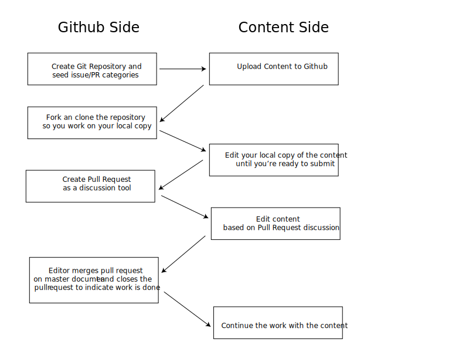

# Creating a github development and publishing workflow

This [blog post](https://github.com/blog/1939-how-github-uses-github-to-document-github) and this [Wired article](http://www.wired.com/2012/02/github-2/all/) made me think about the way in which Github develops their documentation and if we can incorporate a similar proess to a normal publishing development workflow. 

The idea starts with public repositories and then, where necessary, address the differences when working with private repositories or a Github Enterprise solution. 

This workflow asumes a basic level of familarity with Github and the following 

* All participants should understand how handle Github repositories, how to commit files (both initial commit and update) to their repositories and how to create pull requests
* Project editors should also know how to handle pull requests and how to handle conflict merges
* Project leaders should be Github power users or, at the very least, know where to get help

All the skill requirements listed above can be handled through training and support either in-house or from Github.

## Process

The outline below shows the workflow from both a Github and content perspectives. 

### Setting up the project

In the first stages we create the repository in Github and add the content to it. Ideally this initial process would be done by the same person. 

Instructions for creating Github repositories are located in the Github help article: [https://help.github.com/articles/create-a-repo/](https://help.github.com/articles/create-a-repo/)

### Individual contributors fork and clone the project

For the project to be useful each invidividual contributor to the project has to have his/her own copy of the project where to make changes without disrupting the master copy. Different contributors may make different changes to the same file and that's where pull requests (discussed in more details below) come in handy.

Forking and cloning are explained in more detail in this [Github Help article](https://help.github.com/articles/fork-a-repo/)

### Edit your local copy

One of the advantages of this model is that you're making changes to your local copy, not the master repository. If you are not happy with the changes and they are to extensive to undo manually you can always delete your working copy and clone yor repository again. In more extreme cases you can delete your fork of the project in Github and fork it again. This will get you a brand new copy of the project at the cost of loosing any changes you made since the fork was created. 

### Create a pull request for discussion and edit the content as needed

Pull requests allow users to tell each other about changes in the their copy of the repository against the repository the local copy was forked from. 

Pull creation requests are described in this [Github Help article](https://help.github.com/articles/using-pull-requests/)

If you want specific people's attention you can add their username with a `@` infront. if the username is gandalf, you can include them in the conversation using `@gandalf`

### Discuss the content

In addition to the initial pull request notification, the discussions in a Pull request provide notification of:

* Comments left on the pull request itself.
* Additional commits/edits pushed to the pull request's branch.

The request can be left open until everyone agrees it's completed or  until the project lead closes it as complete. 

### Continue working on the project

Depending on the the existing workflow the github-based authoring process can be added as an additional step or hooks can be added to github to further process the content before final publication. 

Github followed this technique by adding hooks that transfer the edited content to an external Ruby on Rails application that served the content. 

If you are serving your content from gh-pages (Github's provided project websites) you can serve the content from the master repository

## Things to research further

Do we need to create branches for the content?

