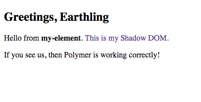

# Polymer and web components, Part 1: Introduction

## Introduction

Over the last few weeks I've been playing with a couple web technologies for developing sites evaluating them for building digital publications. 

Both [Angular JS](https://angularjs.org/) and [Polymer](https://www.polymer-project.org/) started as Google projects that have created wide communities and some promising opportunities for web developers.

I've created a sample project list application in Angular ([code](https://github.com/caraya/project-list-angular) - [live sample](https://caraya.github.io/project-list-angular/)) and Polymer ([code](https://github.com/caraya/polymer-playground) - [live sample](https://caraya.github.io/polymer-list/firebase.html)) as part of the evaluation process. This article will discuss the Polymer / Web Component project.

### What are Web Components? What is Polymer?

Web Components is the umbrella term for a set of technologies that allow developers to extend the web as it is today. The component specifications are:

* **Custom Elements** allow developers to create their own tags and their own semantic structures
* **HTML Templates** gives developers templates for your custom elements, meaning they will all have the same structure, no matter how many copies you make
* **Shadow DOM** allow for style and script encapsulation. Your element's styles will not mess up your main document styles
* **HTML Imports** allow to easily include your components in an exsiting web page

Polymer implements these technologies, along with polyfills to support these technologies in older browsers and a library providing syntactic sugar to make work with Polymer easier and more interesting.

### Is Polymer the only alternative for Web Components?

There are multiple ways to use Web Components. Polymer is just one alternative. 
Besides Polymer, some of the existing libraries and frameworks supporting web components are:

* [Bosonic](http://bosonic.github.io/) is another implementation of web components
* [Mozilla x-tags](http://x-tags.org/) supports only some of the Web Component specifications
* [Polymer.dart](https://www.dartlang.org/polymer/) reimplements Polymer using the Dart language

If the target browser supports it, you can also create custom elements with pure Javascript as explained in this [HTML5 Rocks article](http://www.html5rocks.com/en/tutorials/webcomponents/customelements/) by Eric Bildeman.


### Browser Support

Native web components currently work only in Chrome and Opera (only browsers with full web component support).

Polymer commits to supporting the last two version of browsers.

x-tags provides the widest level of support:

* Firefox 5+ desktop and mobile
* Chrome 4+
* Android 2.1+
* Safari 4+ desktop and mobile
* Internet Explorer 9+
* Opera 11+ desktop and mobile


## Getting Polymer

The Polymer Project recommends [Bower](http://bower.io/) to handle installing Polymer components. This is a two step process that requires access to a terminal or the command prompt.

### Configure Bower

Open a terminal and type the following commands (assuming that Node is already installed):

```bash
[14:12:08] carlos@Rivendell ~ 9710$ npm install -g bower
[14:12:09] carlos@Rivendell ~ 9711$ bower init
```

And follow the prompts. Running this install will allow you to install individual components without downloading zip files or cloning a Github repository. 

### Installing Polymer and core components

To install an individual package use the following command from terminal (installing Polymer as an example)

```bash
[14:12:10] carlos@Rivendell ~ 9712$ bower install --save Polymer/polymer
[14:12:11] carlos@Rivendell ~ 9713$ bower install --save core-components

```

This will get the environment ready to start working on our application. It is important to note that core-components will download all Polymer core components instead of forcing  you to download 

### Testing the setup

To ensure we set up everything properly we'll create a basic polymer element to make sure that everything works ok. The element will look like this:

```html
<link rel="import" href="bower_components/polymer/polymer.html">

<polymer-element name="greeting-element" noscript>
  <template>
  <style>
    span {
      color: #663399;
    }
    
  </style>
  <h2>Greetings, Earthling</h2>
    <p>Hello from <strong>my-element</strong>. <span>This is my Shadow DOM.</span></p>
    
    <p>If you see us, then Polymer is working correctly!</p>
  </template>
</polymer-element>
```

And the index page for our demo will look like this:

```html
<!doctype html>
<html lang="en-US">
<head>
  <meta charset="utf-8">
  <title></title>
  <meta name="description" content="">
  <meta name="viewport" content="width=device-width, initial-scale=1">
  <script src="bower_components/webcomponentsjs/webcomponents.js"></script>
  <link rel="import" href="bower_components/polymer/polymer.html">
  <link rel="import" href="greeting-element.html">
</head>

<body unresolved>
  <greeting-element></greeting-element>
</body>
</html>
```

If your page doesn't look like the image below:



Look at the following for initial troubleshooting

* You are running this in a web server
* Your links to webcomponent.js and Polymer are correct
* The element `name` attribute in your `polymer-element` tag matches the element name in the `greetings.html` page


