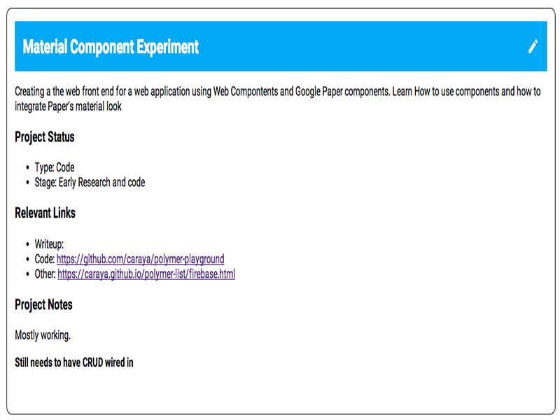

# Polymer and web components, Part 2: Getting Started

## The project list app

To test Web Components and validate assumptions and challenges, I've developed a project list application using Polymer and [Firebase](https://www.firebase.com/). I will walk through the process and some of the challenges I've found. 

### Getting started: Conceptualizing the application

Before we start coding we need to think about what we want the application to do. This makes the coding easier as it gives you direction in your coding and it constrains development (follow the plan and don't go crazy coding)

In the case of the project list application the goals are the following:

* Display a list of projects I'm working on or have recently completed
* For each project provide the following information
    * Type of project (writing, code, other)
    * Project status (research, in progress, completed)
    * Links to code, writing and other resources
    * A description of the project
    * Any additional notes for the project
* Add new projects
* Edit existing projects
* Provide additional information about me

Initially I chose to use JSON for the project. I didn't see a reason to spend money on database hosts or other expensive options.

The JSON for one of the projects looks like this (formated for clarity):

```json
{
      "name": "Material Component Experiment",
      "description": "Creating a the web front end for a web application 
      using Web Compontents and Google Paper components. Learn How to use 
      components and how to integrate Paper’s material look ",
      "url": {
        "writeup": "",
        "code": "https://github.com/caraya/polymer-playground",
        "other": ""
      },
      "type": "Code",
      "stage": "Early Research and code",
      "notes": ""
  }
```

Using this model, I built a list of projects. This is the data source. 

###  Getting started: First look at code

Now that we have our data in a model, we can start coding.  There are two questions at this point:

* How do we want the project to look like? 
* How are we going to connect the data to the view of our project

While we answer these questions we'll visit some important concepts of Web Components and Polymer.

#### Importing necessary elements

```html
<link rel="import" href="bower_components/polymer/polymer.html">
<link rel="import" href="bower_components/core-toolbar/core-toolbar.html">
<link rel="import" href="bower_components/font-roboto/roboto.html">
<link rel="import" href="bower_components/core-ajax/core-ajax.html">
```

Before we start our mock of the project list we need to do some imports. This uses the [HTML Imports](http://www.w3.org/TR/html-imports/) specification. The imports are similar to the way we link CSS stylesheets, the difference is in what we use in the rel attribute, instead of linking a stylesheet we tell the browser that this is an import.

We first import the Polymer Library itself to make sure that all the Polymer-specific goodness will work as we plan.

Then we import the `core-toolbar` element to create the heading for each project

The `font-roboto` element is a wrapper around a link to the Roboto Draft font using the Google Font link syntax. It is equivalent to using the following link: `<link href='//fonts.googleapis.com/css?family=RobotoDraft:regular,bold,italic,thin,light,bolditalic,black,medium&amp;lang=en' rel='stylesheet' type='text/css'>` using a tag instead of the link.

Like the `font-roboto` element, `core-ajax` is a wrapper for XHR functionality. We don't have to write Javascript to get AJAX working on our application, it's all markup!

#### The polymer-element: Creating our tag

```html
<polymer-element name="project-list" attributes="url">
  <!-- Template goes here -->
</polymer-element>
```

When defining our Polymer element we need to keep two things in mind:

* The element's name must have a dash `-` in the name. This is to prevent conflict with elements created elsewhere
* All the attributes that will be used with our new element need to be included in the `attributes` element in our polymer-element definition

An example of our bare element looks like this:

```html
<project-list url="path/to/url">
  <!-- content will go here-->
</project-list>


#### Templates, creating reusable chunks of content

```html
<polymer-element name="project-list" attribute="url">
  <template>
    <!-- Template content goes here -->
  </template>
</polymer-element>
```

Templates, in the context of our Polymer element, allows for encapsulation of content and style. Whatever you put inside the template will be invisible to the host document and will only apply within the template once instantiated.

#### Pulling the data for our application

The first task of our template is to fetch the markdwon document from the URL indicated in our element's `url` attributed. 

```html
<polymer-element name="project-list" attributes="url">
  <template>
      <core-ajax 
         auto 
         url="{{url}}" 
         handleAs="json"
         response="{{projects}}">
      </core-ajax>
      <!-- rest of the template goes here -->
  </template>
</polymer-element>
```

Rather than write Javascript we use the `core-ajax` Polymer element to hide all the complexity of writing the request using a framework or plain Javascript. 

To tell core-ajax the URL to fetch we bind the `url` attribute to the URL parameter of core-ajax using a double moustache `{{}}` syntax similar to Handlebars and other templating languages. 

We handle it as JSON (duh?)

and we bind the AJAX response to the projects variable using the same double moustache syntax. We'll use this variable in the HTML portion of our template.

#### Style Encapsulation: It's mine and you can't have it

BY defining the style inside the template we encapuslate it and make it exclusive to the element the template belongs to using the [shadow DOM](http://w3c.github.io/webcomponents/spec/shadow/) portion of the web components family. 

```html
<polymer-element name="project-list" attributes="url">
  <template>
    <core-ajax 
       auto 
       url="{{url}}" 
       handleAs="json"
       response="{{projects}}">
    </core-ajax>
    <style>
    core-toolbar {
      margin-bottom: 15px;
      background-color: #03A9F4;
      color: white;
    }
    .card {
      font-family: "RobotoDraft", sans-serif;
      border: 1px solid #000; 
      padding: 16px; 
      margin: 16px;
      border-radius: 10px;
    }
    .project-notes {
      margin-bottom: 2.5em;
    }
    </style>
    <!-- rest of the template goes here -->
  </template>
</polymer-element>
```

Regardless of the "light" DOM used in the hosting page, the project-list element will look as we planned it and not affect the layout and styles on the host page. 

### Template HTML content: Where the magic actually happens

Now that I have the data I will use and have styled as much as I can, this is where I start writing the HTML for the element itself mixing Polymer elements and standard HTML.

```html
<!-- Content from prior sections ommited -->
<div class="card">
  <template repeat="{{project, i in projects}}">
    <core-toolbar>
      <h3 flex>{{project.name}}</h3>
      <core-icon 
        class="project-edit"
        icon="editor:mode-edit" 
        alt="Edit Project" on-tap="{{handleEdit}}">
      </core-icon>
    </core-toolbar>
    <div class="project-description">
      {{project.description}}
    </div>

    <h3>Project Status</h3>

    <ul>
      <li>Type: {{project.type}}</li>
      <li>Stage: {{project.stage}}</li>
    </ul>

    <h3>Relevant Links</h3>
    <ul>
      <li>Writeup: <a href="{{project.url.writeup}}">{{project.url.writeup}}</a></li>
      <li>Code: <a href="{{project.url.code}}">{{project.url.code}}</a></li>
      <li>Other: <a href="{{project.url.other}}">{{project.url.other}}</a></li>
    </ul>

    <h3>Project Notes</h3>

    <div class="project-notes">
      {{project.notes}}
    </div><!-- closes project-notes-->
  </template>
</div> <!-- closes card div -->
```

I define a second, inner, template to handle the repeating content for our project and some Polymer-specific elements and attributes. 

When defining the [core toolbar](https://www.polymer-project.org/docs/elements/core-elements.html#core-toolbar) as shown in the image below



We do one additional thing. We make the project title (`&lt;;h3>{{project.title}}&lt`) a flex item by adding the flex attribute; behind the scenes, Polymer will take care of inserting the right flex attributes to the resulting HTML.

The other element inside of the core-toolbar is a core-icon; Polymer's way to add icons to Polymer elements. 

Polymer has a failry extensive collection of SVG icons already available. You can read the instructions for adding images to your icon in the [core-icon documentation](https://www.polymer-project.org/docs/elements/core-elements.html#core-icon) and the default icon sets available in Polymer in the [demo for icon-sets](http://www.polymer-project.org/components/core-icons/demo.html)

The rest of the page is a combination of HTML and binding to elements of each individual project.


The final part of the template is to create a script tag as shown below:

<script>
  Polymer({
  // Any scripted content will go here
  });
</script>

This is required for the element to register as a Polymer component. There is a way to register the component without writing the script tag but I prefer to add it even if I will not use it. 

For more information see Polymer's [element registration documentation](https://www.polymer-project.org/docs/polymer/polymer.html#altregistration)


### The final touches 

Because we want to do something with the edit icon for each project we'll set up the icons to fire an event to be captured elsewhere in the application. 

Inside the Polymer script element

```html
<!-- Content from prior sections ommited -->
<script>
  Polymer({
    handleEdit: function (evt) {
      var idx = evt.target.templateInstance.model.i;
      console.log(idx);
      this.fire('edit-project', {
        projectId: idx,
        data: payload
      });
    }
  });
</script>
```

