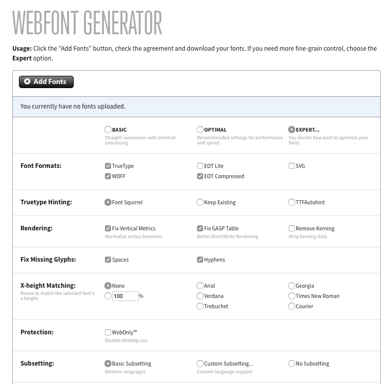

In creating ebooks we need to pay attention to files size... Modern fonts have many more characters than we use in normal books. Subsetting the fonts will allow us to decrease the size of the font by decreasing the number of glyphs and the the number of languages supported by the font in question.

Although for me the primary reason for subseting my fonts is reducing the overall book size, there are other reasons for doing so. Some foundry's require subsetting and font obfuscation as part of their license for eBook embedding. This makes the font less appealing for would-be stealers as it doesn't necessarily have all the characters you need for your project and it's not in clear text so you can't really use it.

We will not, for now, deal with Adobe's [WebKit](https://typekit.com/) fonts as the service goals are different. It doesn't provide the granularity we need to reduce the size of the fonts to a more reasonable size. It does, however, provide basic subsetting for each web font kit you create with the service. Desktop fonts must go through the process below to be properly subset.

## Before we start

Before doing any work with fonts you need to make sure that the font allows you to use it on eBooks and digital publishing. I found this out the hard way when my favorite font was not available for use in eBooks under the license I had purchased it and the cost of the license for eBook and web publishing proved prohibitive.

For the purpose of this and other eBook research projects I will use open source fonts or fonts released under the [SIL open font license](http://scripts.sil.org/cms/scripts/page.php?site_id=nrsi&id=OFL) which is permissive and specifically allow for embedding and subsetting.

## Choosing the tools

I found three tools that did what I wanted to do; make font files smaller by subsetting them to only the characters and unicode pages associated  I need for my book.

### Font Squirrel

Web Squirrel's [webfont generator](http://www.fontsquirrel.com/tools/webfont-generator) has been the go-to tool for web font work since they were reintorduced along with the rest of the HTML5 specification.  It does everything you need to get the fonts displayed in your website: Generates the formats needed for web deployment (TTF, EOT, WOFF and SVG), provides the CSS needed to include the font in your page and, most important for the purpose of this article, gives you expert settings where you can subset the font as needed.

We'll take a look at the different features of the generator, paying particular attention to subsetting.

Before we can start working with the font subsetting tools, we need to tell Font Squirrel which font we want to work with. Only way to do this is to upload the font.

Once the font is uploaded you need to indicate wich level customization we want. For subsetting we want the expert level. Basic and optimal hide the settings we need to subset the font. 

If you're working on the web you will want to subset TrueType, WOFF and EOT compressed. SVG may be necessary if you're supporting older iOS devices only. Newer versions of iOS support TrueType and or WOFF.

I leave the following options:

* Truetype Hinting
* Rendering
* Fix Missing Glyps
* X-height Matching
* Protection

Under Subsetting, I choose custom subsetting. 

### FontFont Subsetter

[FontFont Subsetter](http://www.subsetter.com/) is an online service that support subsetting fonts.  I tried uploading Roboto, a TTF font from Google, and I received the result .

[caption id="attachment_301167" align="aligncenter" width="800"] FontFont Subsetter result when uploading Roboto font[/caption]

According to the FAQ, only certain flavors of TTF fonts are supported by the service. Specifically it states:

> Make sure that you upload a FontFont with the file extension .ttf, .eot or .woff. Subsetter supports TrueType-flavoured Offc FontFonts and Web FontFonts in WOFF or EOT format.

Since I can't be sure if the subsetter will work with the fonts I choose I have to look for something else.

> TODO: Research What they consider FontFont and how to convert a TTF font if it doesn't match what they are looking for

### FontPress 3

[Fontpress](https://github.com/briangonzalez/fontprep/releases) has recently been open sourced and it's available as a download in Github.

It has a drag and drop interface but after you add the fonts to subset it's more complicated than it needs to be.  The resulting font subsets were larger than the original files. I'm not 100% sure if it was the way I did it or if the software is not giving me the results I want.

> TODO: Research the tool. It may do what I want but right now the subset is larger than the original font.
