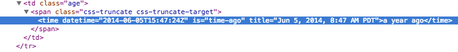

# Web Components: Why? How? What? When? Where?

Now that Polymer has reached 1.0 and that browser vendors are talking about web components, it is time to revisit web components with a more critical eye and ask the following questions:

* **What** are web components?
* **Why** use web components?
* **Why not** use web components?
* **How** to use web components?
* **Where** to use web components?
* **How** to build web components?
* **Should we use** web components now?

We will discuss 3 web component implementations:

* Vanilla web components built by hand using only HTML, CSS and Javascript
* Mozilla's [Bricks and x-tags](https://developer.mozilla.org/en-US/Apps/Tools_and_frameworks/Web_components)
* Google's [Polymer project](https://www.polymer-project.org/1.0/)

In order to make web components work on all modern browsers we must rely, to some degree, in a set of web components [polyfill libraries](http://webcomponents.org/polyfills/) to make sure that the components will work as intended. The only browser to fully support web components is Chrome (as of version 36.) The polyfill is smart enough to know when to let the native systems take over.

With all that out of the way, let's dive to web components.

## What are web components?

Web Components are a set of technologies that allow developers to create custom tags for their web projects. The technologies that make up web components are:

* [Custom Elements](http://w3c.github.io/webcomponents/spec/custom/) allows you to create custom tags for your project-specific needs. These can be brand new tags like book-index or extensions of existing elements with added UI or functionality (super-button or footnote-link)
* [HTML Templates](http://www.w3.org/TR/html5/scripting-1.html#the-template-element) defines a template for your new element. These templates are inert until you instantiate your elements in your page
* [Shadow DOM](http://www.w3.org/TR/shadow-dom/) encapsulates CSS to your custom element. This makes the styles in your components independent of your main document. It has proved to be one of the most problematic aspects of web components but I still think that it's the most useful... if it wasn't then browser vendors wouldn't use it in sliders and video elements
* [HTML Imports](http://www.w3.org/TR/2014/WD-html-imports-20140311/) extends the link element that we use to import CSS style sheets to import web components stored in an HTML element using a similar syntax like so: `<link rel="import" href="/path/to/some/import.html">`

By themselves each standard under the umbrella of web components it's awesome but it's the combination of these technologies that has really deep implications for web developers everywhere. 

X-Tags provides a partial implementation of web components. Mozilla believes that ES6 modules will be a better solution than HTML imports for the same task. See [https://developer.mozilla.org/en-US/Apps/Tools_and_frameworks/Web_components](https://developer.mozilla.org/en-US/Apps/Tools_and_frameworks/Web_components) for more information on X-Tags (the library) and Bricks (the components built with X-Tags)

Polymer provides the basics of web components and opinionated sugar on top of web components to make building applications easier. 

*One thing to note is that, if you've worked with Polymner before 1.0, the Polymer has changed considerably from prior versions. See [the 1.0 release blogpost](https://blog.polymer-project.org/announcements/2015/05/29/one-dot-oh/) for more information about changes and how to get started and [Road to Polymer](http://chuckh.github.io/road-to-polymer/) for ideas and processes on upgrading existing Polymer apps.*

## Why use web components?

I can think of a few reasons why we should build and use web components. 

### Clean and DRY Code

If you look at the source code of any large web application you'll see that it's a mess of divs and enough tags to make it really hard to follow. 

Gmail looks bad in the sense that the source is almost impossible to follow and understand, the class names only make sense to the people developing the application and, most likely, no one else.


So does Facebook


What if we could change all the &lsquo;div soup&rsquo; into something that makes more sense and it's eaier to read? 

Using Polymer we can define a fictional company-module tag with the following information and using an existing iron-icon component (downloadable from the Polymer site):

```html
<dom-module id="company-info">
  <link rel="import" type="css" href="company-info.css">
  <template>
    <content></content>
    <iron-icon icon="star" hidden$="{{!starred}}"></iron-icon>
  </template>
  <script>
    Polymer({
      is: 'company-info',
      properties: {
        starred: Boolean
      }
    });
  </script>
</dom-module>
```

And then instantiate the element for company MYX like so:


```html
<company-info starred>
  
  <span>MYX Corporation</span>
</company-info>
```

Using vanilla web components, we can define a `my-avatar` tag that looks like this:

```html
<my-avatar service="twitter" username="leggetter" />
```

We can then use Javascript to define the attributes necessary for the custom element to work. The code looks like this.

```javascript
var MyAvatarPrototype = Object.create(HTMLElement.prototype);
MyAvatarPrototype.createdCallback = function() {
  var username = this.getAttribute('username');
  var service = this.getAttribute('service');
  var url = 'http://avatars.io/' + service + '/' + username;
  var img = document.createElement( 'img' );
  img.setAttribute('src', url);
  this.appendChild(img);
};
document.registerElement('my-avatar', {
  prototype: MyAvatarPrototype
});
```

It is clear to read, you can immediately see what each portion is supposed to do and how they all fit together. As a content creator you don't need to worry about the backedn sntuff, that's still transparent to you.

### Interoperability

Another thing to consider is interoperability. Right now all major CSS frameworks have their own implementations for things such as button and if you want to use Bootstrap's button in a Foundation app, it's just not worth it, you have to add Bootstrap's bloat to foundation's bloat without knowing how will the CSS and Javascript from each framework interact with other scripts and style sheets. 

Web components reduce the likelyhood of interoperability issues.

Because Shadow DOM hides the CSS on your component from the host page, we don't need to worry about the component styles affecting the page and viceversa. There are ways to pierce the boundary between host and components but that will most definitely change before webcomponents become specifications. 

Until then we can rely on web components as an encapsulated repositories for our discrete pieces of CSS, HTML and Javascript.

### Composability

<div class='video'>
<iframe width="560" height="315" src="https://www.youtube.com/embed/6vcQlD-jadk" frameborder="0" allowfullscreen></iframe>
</div>

Since we can put components from multiple sources or multiple components from a single source, we can compose an application from smaller single-purpose components. 

* **webcomponents.js** to make sure it'll work on all browsers
* **polymer** to add all the syntactic sugar Polymer gives us
* **iron-ajax** to fetch the content
* **marked-element** to provide the translation from Markdown to HTML


**Component below is being updated for Poymer 1.0, it is currently not displaying the Markdown content**

```html
  <script src="bower_components/webcomponentsjs/webcomponents.js">
  <link rel="import" href="bower_components/polymer/polymer.html">
  <link rel="import" href="bower_components/iron-ajax/iron-ajax.html">
  <link rel="import" href="bower_components/marked-element/marked-element.html">
```

Once the components are imported and loaded, we can begin using them. We use core-ajax to load the document located at `url` as text using the response as `doc`. We then use `marked-element` with `doc` as its value. This will convert the markdown as HTML and render it in our document.

```html
<dom-element id="athena-document">
  <style>/* styles will eventually go here */</style>
  <template>
    <iron-ajax auto url="{{url}}" handle-as="text"></iron-ajax>
    <marked-element markdown={{url}}></marked-element>
  </template>
  <script>
    Polymer ({
      is: "athena-document",

      properties: {
        url: {
          type: String,
          value: ''
        }
      }
    })
  </script>
</dom-element>
```

Because components are composable and Google provides a large [Catalog](https://elements.polymer-project.org/) of components for people to build our applications with, we can concentrate on our own application specific or task specific components and build larger applications without having to reinvent the wheel every time (also known as keeping our code DRY) 

## How to use web components?

When I first started working with Web Components I looked at the biggest way to use them. In creating my own components I own all of the component, the scripts, the encapsulated CSS and the responsibility of making sure that they worked and worked well with other components and other elements in the page.

In learning how to use Web Components we'll look at both the big and the small picture: Creating full custom components and createying type extension custom elements.

### Custom Components

The ability to create fully customized and reusable elements is what attracted me to Polymer and the concept of web components. The elements we create can be as simple or as complex as we need them to be.... We can also add other components to enhance the functionality of our components.

The example below (taken from the Polymer Project's home page) shows what a custom element built with Polymer 1.0 looks like.

```html
<dom-module id="contact-card">
  <link rel="import" type="css" href="contact-card.css">
  <template>
    <content></content>
    <iron-icon icon="star" hidden$="{{!starred}}"></iron-icon>
  </template>
  <script>
    Polymer({
      is: 'contact-card',
      properties: {
        starred: Boolean
      }
    });
  </script>
</dom-module>
```

And how we use the component on our document.

```html
<contact-card starred>
  
  <span>Eric Bidelman</span>
</contact-card>
```

### Extending existing elements (Type Extension Custom Elements)

There are times when a custom element is too much. We might need a smaller chunk of functionality or we  may need to enhance an already-existing element instead of creating a whole new element. You can create a custom element that extends a native HTML element and its features. This is called a Type Extension Custom Element. To use the element, use the original tag and specify the custom tag name using the is attribute.

```html
<input is="x-component"></div>
```

To define a type extension:

* Create the base prototype object using the prototype of the extended element, instead of HTMLElement.
* Add an extends key in the second argument to document.registerElement(), specifying the tag name of the extended element.

Following is an example code when extending the input element:

```javascript
var XComponent = document.registerElement('x-component', {
  extends: 'input',
  prototype: Object.create(HTMLInputElement.prototype)
});
```

Notice that it extends: 'input' and its prototype is based on HTMLInputElement instead of HTMLElement. Now you can use `&lt;input is="x-component">` inside your document. By doing so, you can have extended APIs on top of basic input element's features.


#### Github's example


GitHub has a many components that displays date and time as shown above. Notice they are not absolute dates/times but relative to the browser's current time. GitHub uses a Type Extension Custom Element accomplish this. The HTML code looks like this:



There some things to notice:

* time tag is used as a base element
* datetime attribute indicates an absolute date/time
* `is='time-ago'` specifies a type extension
* The tag's content indicates a relative date/time
* This is done on the fly as a type extension.

Even if web components are not supported or Javascript is disabled we will still be able to see when the file was last changed. If you disable Javascript from your browser's 

For more details about time-elements, check webcomponents.org's [How GitHub is using Web Components in production](http://webcomponents.org/articles/interview-with-joshua-peek/).


## Why not use web components?

[Wilson Page](http://wilsonpage.co.uk/) wrote a lengthy article in Mozilla Hacks about [the state of web components](https://hacks.mozilla.org/2015/06/the-state-of-web-components/). What I found most interesting about the piece are the reasons why web components have not reached recommendation status in the W3C. Quoting the article:

>By now, 4 years on, Web Components should be everywhere, but in reality Chrome is the only browser with ‘some version’ of Web Components. Even with polyfills it’s clear Web Components won’t be fully embraced by the community until the majority of browsers are on-board.

> ## Why has this taken so long?

> To cut a long story short, vendors couldn’t agree.

> Web Components were a Google effort and little negotiation was made with other browsers before shipping. Like most negotiations in life, parties that don’t feel involved lack enthusiasm and tend not to agree.

> Web Components were an ambitious proposal. Initial APIs were high-level and complex to implement (albeit for good reasons), which only added to contention and disagreement between vendors.

> Google pushed forward, they sought feedback, gained community buy-in; but in hindsight, before other vendors shipped, usability was blocked.

> Polyfills meant theoretically Web Components could work on browsers that hadn’t yet implemented, but these have never been accepted as ‘suitable for production’.

> Aside from all this, Microsoft haven’t been in a position to add many new DOM APIs due to the [Edge](http://www.microsoft.com/en-us/windows/browser-for-doing) work (nearing completion). And Apple, have been focusing on alternative features for Safari.

When I look at the article outlining alternative proposals and opossition to the concept as specified and currently implemented and polyfilled makes me wonder if this is another example of [bike shedding](http://blue.bikeshed.org/). 

If accessibility is an issue, then perhaps you'd be better off without web components until some of the issues outline by Dominic in his [web component accessibility analysis](https://github.com/domenic/html-as-custom-elements/blob/master/docs/accessibility.md) are resolved. 

## Where to use web components?

I'm mostly familiar with using Web Components (specifically Polymer) as the front end for either JSON or Firebase backends. My research has turned to how do we make web components play nice with other frameworks, MVC and otherwise. 

Sole Penad&eacute;s talks about Web Components and also what to expect when using web components with other frameworks :)

<div class="video">
  <iframe src="https://player.vimeo.com/video/121954532" width="500" height="281" frameborder="0" webkitallowfullscreen mozallowfullscreen allowfullscreen></iframe>
</div>

We can take two approaches to Web Components: Whole cloth or progressive enhancement.

Whole cloth is building a custom element hierarchy with the associated elements needed to achieve your application goals. It may require multiple elements like the ones below where each element is defined and imported in a separate document with its own CSS and Javascript associated with each element.

```html
<my-app>
  <my-app-header>
    <iron-icon></iron-icon>
    <title></title>
    <my-app-menu></my-app-menu>
  </my-app-header>
  
  <my-app-body>
    <content></content>
  </my-app-body>
</my-app>
```

A progressive enhancement approach is what Github did. Instead of going full bore with defining new components, we can enhance portions of our application by extending what is already there in a similr fashion to what Github did (and we discussed above). Taking the `my-avatar` element we created earlier we'll revisit the code to make it work as a component.

```javascript
var MyAvatarPrototype = Object.create(HTMLElement.prototype);
MyAvatarPrototype.createdCallback = function() {
  var username = this.getAttribute('username');
  var service = this.getAttribute('service');
  var url = 'http://avatars.io/' + service + '/' + username;
  var img = document.createElement( 'img' );
  img.setAttribute('src', url);
  this.appendChild(img);
};

document.registerElement('my-avatar', {
  prototype: MyAvatarPrototype
});
```

And then call it as we normally would:

```html
<my-avatar username='myname' service='twitter'></my-avatar>
```

### So which one should we use?

As with everything on the web the answer is, it depends.

Type extension elements have the draw that, if they don't work (either because Javascript is disabled, polyfills are not available or custom elements are not supported), content will still be displayed to the user.

For larger projects where type extension elements are not enough, full blown custom elemets are necessary with all the additional weight and performance penalties they carry if you're not careful when implementing them. 

Paul Lewis' blog post [Polymer for the performance obsessed](https://aerotwist.com/blog/polymer-for-the-performance-obsessed/) outlines some of the requirements to improve a Polymer application's performance. It would be interesting to see how much of the post (given where Paul works) is applicable to vanilla components and x-tag built elements

In the end the type of component you use depends on your project and your needs.

## How to build web components?

[dsheiko.com](http://dsheiko.com/weblog/creating-a-web-component-with-vanillajs-x-tag-and-polymer) provides a good overview on how to create web components using different libraries. We'll take the vanilla JS and x-tags implementations from the article. Even though the article does provide a Polymer implementation, it uses the old syntax so I'll create my own example instead.

The associated code for the article is available on the [Github Repository](https://github.com/dsheiko/x-reference.git)

### VanillaJS

For vanilla JS we will build a business card similar to the one offered by Google Plus. It doesn't need to be sophisticated, it just needs to provide some basic information and needs to do so in a way that is easy to use and doesn't create unnecessary complexities. The end result will look like this:


### X-Tags

X-tags implementation of Web Components lacks the capability to import elements; their justification is that they are waiting to see if Javascript modules will work to avoid standards and technologies that duplicate each other. 

### Polymer

Polymer has gotten more complicated since I last played with it in the 0.5 but it's still fairly easy to implement and modify. We'll explore some of the changes from 0.5 to 1.0 and some of the syntactic sugar that makes working with web components fun.

## Conclusion: Should we use web components now?


It depends on your target platforms. The only desktop browser to fully implement web components is Chrome (and by extension Opera) so the `webcomponent.js` polyfill must be used for any kind of meaningful support. It's also important to note that the polyfills don't work particularly well on mobile devices and I haven't tested them in any e-book reader.

It depends on the the scope of your planned components. If your planning to progressively upgrade elements on your page then it makes sense to take the plunge and use them now. However, if you're planning full blown applications based on components you may be better off waiting until the specifications finalilze and browsers add native support.

