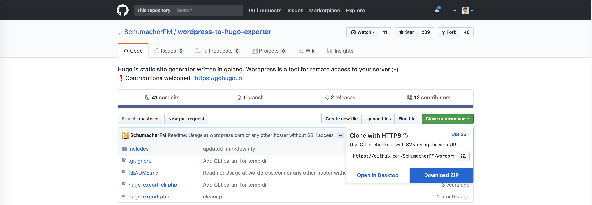
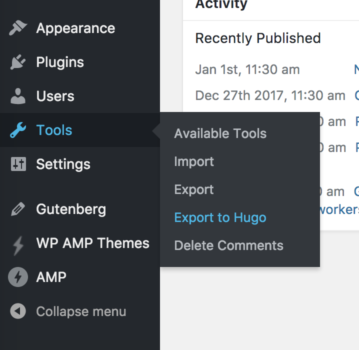
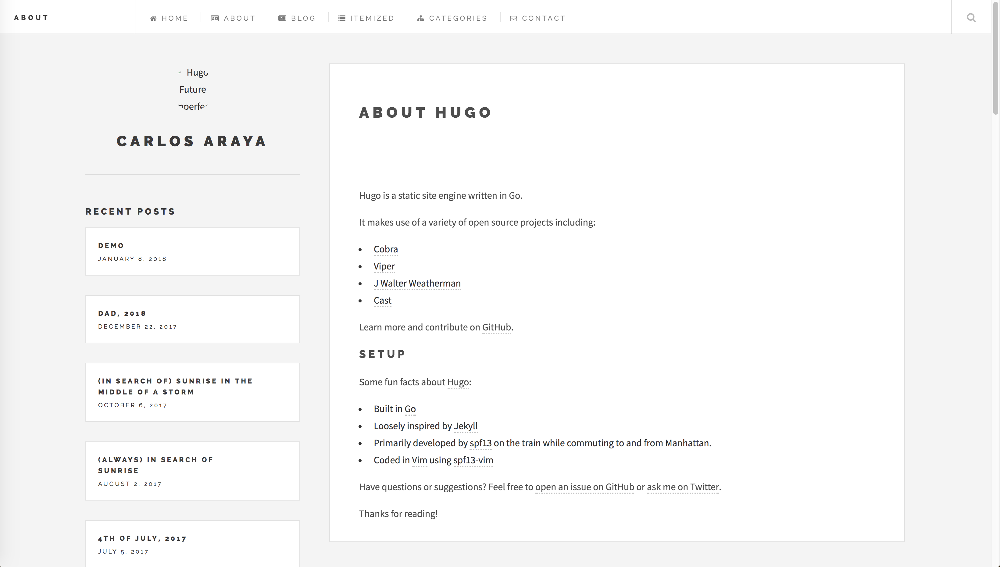

# Rebuilding Labs as a Static Site

I've been wanting to move my experiment website ([labs.rivendellweb.net](https://labs.rivendellweb.net/)) to a static site since I took down the last template version a few months ago.

I was looking at different types of static site generators. I looked at [Jekyll](https://jekyllrb.com/) (because it powers [Github Pages](https://pages.github.com/)) and began working with [Assemble](http://assemble.io/) so I can leverage my existing Gulp based tools and workflows but I wasn't able to get much done because of time committments and having to mold the tool to do what I wanted.

Sara Soueidan's [Migrating from Jekyll+Github Pages to Hugo+Netlify](https://www.sarasoueidan.com/blog/jekyll-ghpages-to-hugo-netlify/) pointed me to [Hugo](https://gohugo.io/) a static site generator written in [Go](https://golang.org/).

## Installing Hugo

I work primarily in a Mac and will use [Homebrew](https://brew.sh/) to install it.

```bash
brew upgrade && brew install hugo
```

Note that these commands will also updgrade all your existing packages.

To test the installation run the following command:

```bash
hugo version
```

In my Mac it will produce the following result. This is the latest version as of the writing date.

```bash
Hugo Static Site Generator v0.32.3 darwin/amd64 BuildDate: 2018-01-09T16:09:57-08:00
```
For other Operating Systems and package managers see the [Hugo Installation Guide](https://gohugo.io/getting-started/installing/)

## The easy way: Migrating a blog from WordPress

Because of the possibility of Wordpress going to a Gutenberg only content editing and content creation tool. What really raised a flag for me was this [issue](https://github.com/Automattic/_s/issues/1248) in the _s theme repository regarding [Gutenberg](https://wordpress.org/gutenberg/) code blocks, particularly Rand Morten Henriksen's [reply](https://github.com/Automattic/_s/issues/1248#issuecomment-354533012).

It seems that after the first phase where Gutenberg will be optional, meaning that if you don't want to use it or have content that relies on the traditional editor's layout you can disable it via another plugin, you will be forced to use Gutenberg and its blocks regardless of what you needs are.

I'm leary of the amount of work I will have to do to migrate my existing blogs (10- and 5-year old) to the new structure so I've began exploring options to move them to a different platform. Because I've been using Wordpres since 2.6 I haven't had the advantage of creating content with the new tools. I've customized both templates and style sheets to suit my needs. I write content in markdown and have special classes to customize the content.

So here comes the first challenge: `How to move WordPress content to Hugo?` To my surprise this proved easier than creating a site from scratch.

### Building the Hugo Site

Building the Hugo site is simple, run the following command:

```bash
hugo new site blog
```

if the command ran successfully you should see the following block of text on your terminal

```
Congratulations! Your new Hugo site is created in /Users/carlos/code/temp/blog.

Just a few more steps and you're ready to go:

1. Download a theme into the same-named folder.
   Choose a theme from https://themes.gohugo.io/, or
   create your own with the "hugo new theme <THEMENAME>" command.
2. Perhaps you want to add some content. You can add single files
   with "hugo new <SECTIONNAME>/<FILENAME>.<FORMAT>".
3. Start the built-in live server via "hugo server".

Visit https://gohugo.io/ for quickstart guide and full documentation.
```

### Getting the Wordpress Content

To export the content from WordPress I will use [wordpress-to-hugo-exporter](https://github.com/SchumacherFM/wordpress-to-hugo-exporter) as my exporting tool

1. Download a zip file for the repository from Github. I choose to download a zip file rather than clone the repository because WordPress requires me to upload a zip file of the plugin. See figure 1 for the location of the save to zip button
2. Upload the plugin to your WordPress Installation
3. Activate plugin in WordPress dashboard
4. Select Export to Hugo from the Tools menu (Figure 2)

<figure>
  
  <figcaption>Downloading a zip file from a Github repository</figcaption>
</figure>

<figure>
  
  <figcaption>Export to Hugo link under Tools</figcaption>
</figure>

The exporter:

* Converts all posts, pages, and settings from WordPress for use in Hugo
* Export what your users see, not what the database stores (runs post content through the_content filter prior to export, allowing third-party plugins to modify the output)
* Converts all post_content to Markdown Extra (using Markdownify)
* Converts all `post_meta` and fields within the `wp_posts` table to YAML front matter for parsing by Hugo.
* Export private posts and drafts. They are marked as drafts as well and won't get published with Hugo.
* Generates a config.yaml with all settings in the wp_options table
* Outputs a single zip file with `config.yaml`, pages, and post folder containing .md files for each post in the proper Hugo naming convention.

Depending on the number of posts, pages and associated resources this may take a while to generate the `hugo-export.zip` file. Depending on the site's traffic it may be better to clone the content to a local development instance and run the exporter from there.


### Installing the theme

Rather than create a theme from scratch (we'll save that for later) we'll use a premade theme. For this example I've selected [Hugo Future Imperfect](https://github.com/jpescador/hugo-future-imperfect) as the theme for my blog. I like the design and the look of the theme and would consider using it in production.

<figure>
  
  <figcaption>Hugo Future Imperfect theme screenshot</figcaption>
</figure>

To install the theme follow these instructions:

1. Download a zip file of the Hugo Future Imperfect [repository](https://github.com/jpescador/hugo-future-imperfect)
2. Copy the zip file into your site's theme folder and unzip it. **Note that in macOS High Sierra you should unzip the file using command line tools, the Packager utility did not work for me**
3. Copy the theme's `config.toml` into the root of your Hugo site. **Make sure you backup the `config.toml` file that's already there.** This will make sure that the basic theme configuration is picked up

### Installing the content

Before installing the theme it's a good idea to have the content ready to go. The instructions below assume that you've unpacked the content as indicated in `Getting the Wordpress Content`.

1. Copy the posts folder to the site's content folder
2. Rename the `posts` folder `blog` (to make sure that the blog heaading will work as intended)
3. Copy any pages from the export file into the content folder
    * Move the file under a folder with the name you want to appear in the blog heading, for example `about`
    * Rename the file `_index.md`

The structure of the project now looks like this:

```bash
.
├── archetypes
│   ├── default.md
│   └── post.md
├── config.toml
├── config.toml-old
├── content
│   ├── about
│   ├── blog
│   └── contact
├── data
├── hugo-export
│   ├── about
│   ├── blog
│   ├── chronological-view
│   ├── config.yaml
│   ├── now
│   ├── nowff
│   ├── plugins-being-used
│   ├── sample-page
│   ├── sitemap
│   └── wpforms-preview
├── layouts
├── personal-hugo-export.zip
├── public
│   ├── 404.html
│   ├── categories
│   ├── css
│   ├── index.html
│   ├── index.xml
│   ├── js
│   ├── sitemap.xml
│   └── tags
├── static
└── themes
    └── hugo-future-imperfect
```

<a id="markdown-testing-the-result" name="testing-the-result"></a>
### Testing the Result

Now we get to test the site as it'll look to Hugo.

Run the following command:

```bash
hugo serve
```

Then, using your favorite browser, go to `http://localhost:1313`

<figure>
  
  <figcaption>Final Result in Chrome</figcaption>
</figure>

### Deploying for production

Uploading the Hugo site for prooduction is as simple as running the following command:

```bash
hugo
```

and uploading the content of the `public` folder into your site.

### Customizations and Future Ideas

So far we've worked and looked at the site in its default state. We can tweak settings, customize the content and create new types of content. Remember that we're working with raw HTML, CSS and Javascript and can modify it accordingly.

One big thing is to test if [Cloudinary](https://cloudinary.com/) works well with a static site as a replacement for Jetpack's [Photon](https://jetpack.com/support/photon/) service for responsive images CDN and caching.

The hardest part is learning [Go](https://golang.org/), its [templates](https://golang.org/pkg/text/template/) and how they work in the context of a Hugo theme.

## Building From A Boilerplate

The blog worked flawlessly considering the amount of work that I put into it. It's a very promising idea for what I want to do with them. For more advanced content it's not enough.

For the labs project I want to make sure I have access to [SCSS/SASS](http://sass-lang.com/) tools, processing ES2015+ and, if necessary, transpiling it to what current browsers support among other things

### Downloading the Boilerplate and Basic Customization

<blockquote class="twitter-tweet" data-partner="tweetdeck"><p lang="en" dir="ltr">“Any fool can write code that a computer can understand. Good programmers write code that humans can understand.” - Martin Fowler</p>&mdash; Programming Wisdom (@CodeWisdom) <a href="https://twitter.com/CodeWisdom/status/951529719937323010?ref_src=twsrc%5Etfw">January 11, 2018</a></blockquote>

I started working with [victor-hugo](https://github.com/netlify/victor-hugo) as my basis. Victor-hugo is Netlify's Hugo starter template. As I was working and customizing the project I decided to move it to a separate repository, thus was born [hugo-strange](https://github.com/caraya/hugo-strange).

Some of the changes I made to `hugo-strange` from the original `victor-hugo` install:

* Convert SCSS/SASS to CSS and apply autoprefixer
* Run [UNCSS](https://www.npmjs.com/package/gulp-uncss) to remove unnecessary CSS
* Run [Critical](https://github.com/addyosmani/critical) to inline critical path CSS
* Use modern Javascript (ES2015, 2016, 2017 and beyond) using Babel and the [preset-env](https://www.npmjs.com/package/babel-preset-env) plugin that will only transform the code that is not supported by a specified list of browser versions compiled using [browserlist](https://github.com/ai/browserslist)
* Lint Javascript using [eslint](https://github.com/adametry/gulp-eslint) and Google's [eslint preset](https://www.npmjs.com/package/eslint-config-google)
* Generte documentation for the Javascript using [JSDoc](https://www.npmjs.com/package/gulp-jsdoc3)
* Reduce image size using [imagemin](https://www.npmjs.com/package/gulp-imagemin) and format specific plugins
* Generate a set of responsive images for each jpeg and png images
* Perform accessibility testing using [gulp-axe-webdriver](https://www.npmjs.com/package/gulp-axe-webdriver)
* Test for vulnerabilities in your package dependencies using [gulp-snyk](https://www.npmjs.com/package/gulp-snyk)
* We've also upgraded Babel to 7 Beta 36 and Gulp to Gulp 4 (finally released!) We'll come back to this later when we discuss some of the gotchas of the project

With all these tasks and the new utilities it took a while to get the code working and, to me, that was a prerequisite before moving into creating content. It made no sense to create the content before I could build the site.

### Defining your content types

Right now I'm thinking about the following content types for the site:

<dl>
  <dt><strong>Essays</strong></dt>
  <dd>Long form writing about technology topics, either code related or opinion pieces. May be incorporated in to the publishing-project blog at a later time.</dd>

  <dt><strong>Case Studies / Projects</strong></dt>
  <dd>Fully fleshed out projects. Similar to essays but imply a result, either a fully working site or some other working product. This section includes only a description of the results and the result itself. If there's a longer written piece that would go in <em><strong>Essays</strong></em></dd>

  <dt><strong>About</strong></dt>
  <dd>Content about the site and author. May also include contact information and social media</dd>
</dl>

What I like about Hugo is that it gives me enough flexibility to create content without framework restrictions or obstacles.

### Creating content and templates

There is no theme for this project as I use Labs to experiment with different layout techniques and to keep up with writing CSS, Javascript and HTML by hand.

The instructions for using themes with victor-hugo/hugo-strange are more complicated than I want to deal with so the best solution, in my opinion, is to code everything by hand.

#### Creating Templates

#### Content Front Matter And Custom Metadata

#### Archetypes

## Lessons Learned

**Never upgrade more than one tool at a time.**

Last September (2017) I wrote [Migrating projects to Gulp 4.0 and ES6](https://publishing-project.rivendellweb.net/migrating-projects-to-gulp-4-0-and-es6/) as I was exploring the new tool and the changes that it introduced to the Gulp ecosystem.  At the time it only ran it with Babel 6 so I though it would be ok if I also upgraded Babel at the same time.

**Make sure that you keep your dependencies up to date**

Had a rather embarrasing incident when working on this project. A dependency started giving warnings about peer dependencies. Check the dependency tree and make sure those are up to date.  I didn't and filed a bug on the plugin before running `npm ls` to find out
